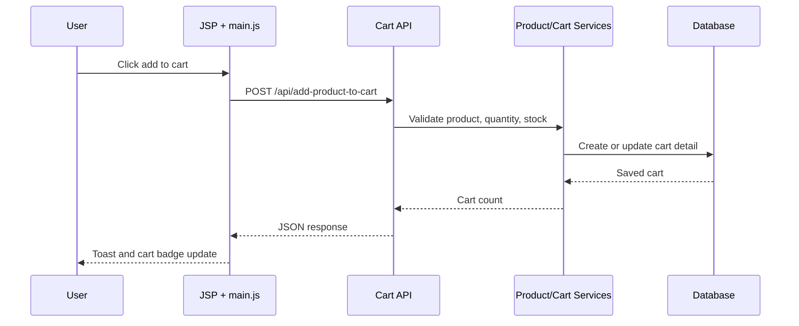
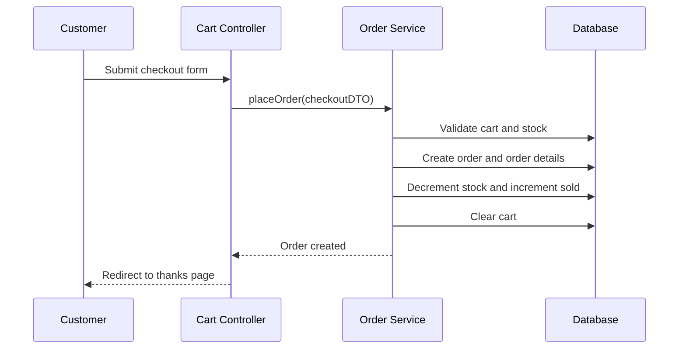

# Architecture

Laptopshop is a server-rendered Spring Boot MVC application. The project keeps a simple layered architecture so the app is easy to explain in interviews and easy to extend.

## Runtime Shape

```mermaid
flowchart LR
    "Browser" --> "Spring MVC Controllers"
    "Spring MVC Controllers" --> "Services"
    "Services" --> "Spring Data Repositories"
    "Spring Data Repositories" --> "MySQL"
    "Controllers" --> "JSP Views"
    "JSP Views" --> "CSS/JS Assets"
    "Spring Security" --> "Controllers"
    "Spring Session JDBC" --> "MySQL"
```

## Layers

| Layer | Responsibility |
| --- | --- |
| `config` | Security, session, view resolver, static resource mappings |
| `controller/client` | Storefront, account, cart, checkout, API entry points |
| `controller/admin` | Admin dashboard and CRUD screens |
| `domain` | JPA entities and form/API DTOs |
| `repository` | Spring Data database access |
| `service` | Business rules, transactions, stock/order/cart behavior |
| `service/specification` | Product catalog filtering and search |
| `WEB-INF/view` | JSP screens and reusable fragments |
| `resources/css` | Design tokens, components, client/admin themes |
| `resources/js` | Shared UI behavior and storefront API interactions |

## Key Flows

### Add To Cart



### Checkout



## Security Model

- Public: home, about, catalog, product detail, login, register, static assets.
- Customer: account, cart, checkout, order history, cart API.
- Admin: `/admin/**`.
- API authentication failures return JSON `401`.
- Missing product/order/user resources use explicit not-found behavior where relevant.

## Data Strategy

- MySQL is used for local and production-like runs.
- H2 is used for automated tests.
- The `local` profile can seed demo roles, users, products, cart, and order history.
- The `prod` profile disables local seed behavior and expects external database credentials.

## Extension Points

Good next feature slices:

- Payment gateway adapter behind a service interface.
- Product image CDN or object storage adapter.
- Admin analytics grouped by day/month.
- Email notification service for order status changes.
